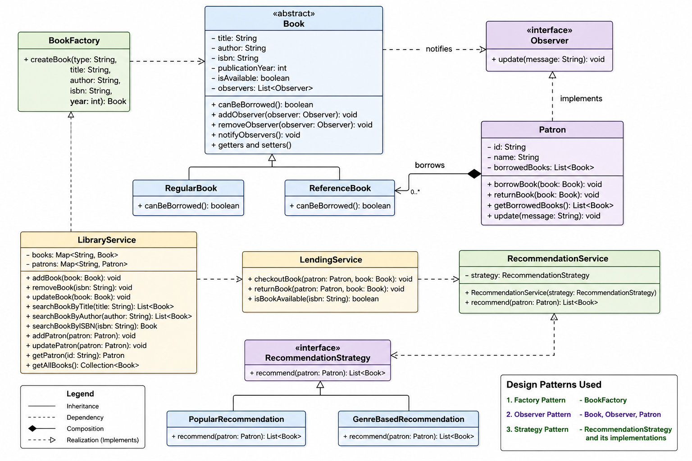

-----Library Management System (Java)------

This project is a "Library Management System" implemented in Java, designed to demonstrate strong understanding of:

* Object-Oriented Programming (OOP)
* SOLID Principles
* Design Patterns (Factory, Observer, Strategy)

The system allows librarians to manage books, patrons, and lending processes efficiently.

-------------------------------------------------------------------------------

***** Book Management *****

* Add, remove, and update books
* Search books by:

    * Title
    * Author
    * ISBN
* Support for different book types:

    * Regular Books (borrowable)
    * Reference Books (non-borrowable)

-------------------------------------------------------------------------------

***** Patron Management *****

* Register new patrons
* Track borrowed books
* Maintain borrowing history

-------------------------------------------------------------------------------

*****Inventory Management *****

* Track available vs borrowed books
* Prevent invalid operations (e.g., borrowing unavailable books)

-------------------------------------------------------------------------------

******** Design Patterns Used ********

***** Factory Pattern *****

Used to create different types of books without exposing instantiation logic.

-------------------------------------------------------------------------------

***** Observer Pattern *****

Used for the **reservation/notification system**.

-Patrons are notified when a book becomes available.

-------------------------------------------------------------------------------

***** Strategy Pattern *****

Used for the "recommendation system".

* Allows switching between different recommendation algorithms dynamically.

-------------------------------------------------------------------------------

***** SOLID Principles Applied *****

Single Responsibility - Separate classes for Book, Patron, Services 
Open/Closed           - New book types added via Factory            
Liskov Substitution   - Book subclasses behave consistently         
Interface Segregation - Small interfaces (Observer, Strategy)       
Dependency Inversion  - Services depend on abstractions             

----------------------------------------------------------------------------------
